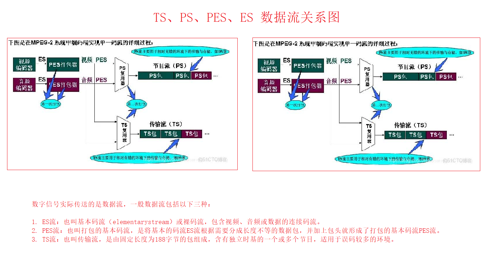
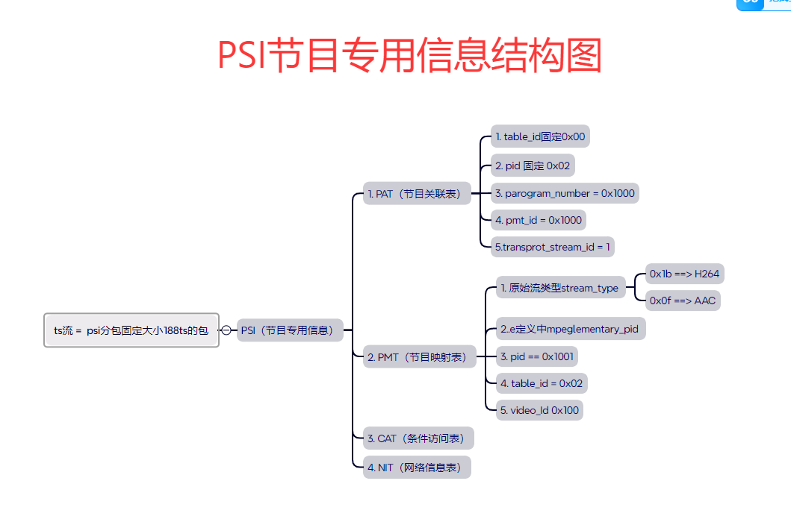

# libmpeg

# 一、数字信号实际传送的是数据流，一般数据流包括以下三种：

1. ES流：也叫基本码流（elementarystream）或裸码流，包含视频、音频或数据的连续码流。
2. PES流：也叫打包的基本码流，是将基本的码流ES流根据需要分成长度不等的数据包，并加上包头就形成了打包的基本码流PES流。
3. TS流：也叫传输流，是由固定长度为188字节的包组成，含有独立时基的一个或多个节目，适用于误码较多的环境。




#  二、PSI 节目专用信息



# 三、 PS流

## 1、 PS包整体结构

```
[PS Header] → [System Header] → [PSM] → [视频PES包] → [音频PES包] → [Padding（可选）]
```


1、视频关键帧的封装 RTP + PS header + PS system header + PS system Map + PES header +h264 data

2、视频非关键帧的封装 RTP +PS header + PES header + h264 data

3、音频帧的封装: RTP + PES header + G711

```
       MPEG-4视频流： 0x10；
       H.264视频流： 0x1B；
       SVAC视频流： 0x80；
       G.711音频流： 0x90；
       G.722.1音频流： 0x92；
       G.723.1音频流： 0x93；
       G.729音频流： 0x99；
      SVAC音频流： 0x9B。
```

## 2、PS包详细字段解析


### ① PS Header


|字段名	|长度（字节）	|值示例/描述|
|:---|:---:|:---:|
|Start Code	|4|	00 00 01 BA（固定起始码）|
|SCR（系统时钟参考）|	6	|高33位为SCR基值（90kHz时钟），低9位为SCR扩展值。示例：44 00 00 03 FF FF|
|MUX Rate	|3|	复用速率（单位：50字节/秒），填充FF FF FF表示未定义。|
|Reserved	|1|	固定FF|
 
### ②、System Header

|字段名	|长度（字节）|	描述|
|:---:|:---:|:---:|
|Start Code	|4|	00 00 01 BB|
|Header Length|	2|	后续字段总长度（如00 0C表示12字节）|
|Rate Bound|	3|	最大复用速率（单位：50字节/秒），示例：80 00 01|
|Audio/Video Flags|	1|	位掩码标识（如0xFF表示支持所有流类型）。|
|Reserved|	6|	填充FF FF FC 00 00 00|
 
### ③、 PSM（Program Stream Map）

|字段名|	长度（字节）|	描述|
|:---:|:---:|:---:|
|Start Code|	4|	00 00 01 BC|
|PSM Length|	2	|PSM数据总长度（如00 08表示8字节）[不占用开始符（Start code）]|
|Stream Entries	|<br>可变|	每项描述一个基本流： <br>视频示例：0F E0 00 1B → Stream ID=0xE0（视频），Stream Type=0x1B（H.264） <br>音频示例：1B BD 00 → Stream ID=0xBD（音频），Stream Type=0x1B（G.711）|
 
### ④ PES（Packetized Elementary Stream）

|字段名	|长度（字节）|	描述|
|:---:|:---:|:---:|
|Start Code|	4	|00 00 01 E0（视频）或00 00 01 C0（音频）|
|PES Packet Length|	2	|PES包总长度（若未知填00 00）[不占用开始符（Start code）]|
|packet info|2|包的信息|
|P	|1|	填充数据的大小| 
|Payload Data	|可变	|音视频裸数据（如H.264 NALU、G.711帧）。|


### 视频封装（以H.264为例）


```
// PES
// -----------------
//     0                   1                   2                   3
//     0 1 2 3 4 5 6 7 8 9 0 1 2 3 4 5 6 7 8 9 0 1 2 3 4 5 6 7 8 9 0 1
//    +-+-+-+-+-+-+-+-+-+-+-+-+-+-+-+-+-+-+-+-+-+-+-+-+-+-+-+-+-+-+-+-+
//    |                         start code   4byte                    |
//    +=+=+=+=+=+=+=+=+=+=+=+=+=+=+=+=+=+=+=+=+=+=+=+=+=+=+=+=+=+=+=+=+
//  0 |    pes length      2byte       |   PTS/DTS  3byte   
//    +-+-+-+-+-+-+-+-+-+-+-+-+-+-+-+-+-+-+-+-+-+-+-+-+-+-+-+-+-+-+-+-+
//  4 |               |P|                                             |
//    +-+-+-+-+-+-+-+-+-+-+-+-+-+-+-+-+-+-+-+-+-+-+-+-+-+-+-+-+-+-+-+-+
//  8 |                                                               |
//    +-+-+-+-+-+-+-+-+-+-+-+-+-+-+-+-+-+-+-+-+-+-+-+-+-+-+-+-+-+-+-+-+
// 12 |         ..... audio data / video data   ....                  |
//    +-+-+-+-+-+-+-+-+-+-+-+-+-+-+-+-+-+-+-+-+-+-+-+-+-+-+-+-+-+-+-+-+
```


1. 生成PES包

1） 提取NALU：从H.264码流中获取NALU（如SPS、PPS、I帧、P帧）。

2） 封装为PES包：

```
   00 00 01 E0          // 视频PES起始码（Stream ID=0xE0）
   00 00                // PES包长度（若未知填0）
   80 80 05             // PES头标志（PTS/DTS存在）
   21 00 07 00 00       // PTS=0x2100070000（90kHz时钟）
   00 00 00 01 67 ...   // H.264 SPS数据

```

2. 关键帧处理

插入SPS/PPS：在I帧的PES包前插入携带SPS/PPS的PES包：

```
  00 00 01 E0 ... [PES头] 00 00 00 01 67 ... // SPS
  00 00 01 E0 ... [PES头] 00 00 00 01 68 ... // PPS
  00 00 01 E0 ... [PES头] 00 00 00 01 65 ... // I帧

```

3)  时间戳同步

计算PTS/DTS：

```
  // 帧率25fps时，每帧时间戳增量 = 90000 / 25 = 3600
  pts += 3600;
  dts = pts; // 若无B帧，DTS=PTS
```

####  音频封装（以G.711为例）

1) 生成PES包

切分音频帧：每20ms（160字节）的G.711数据为一帧。

封装为PES包：

```
   00 00 01 C0          // 音频PES起始码（Stream ID=0xC0）
   00 A0                // PES包长度=160字节
   84 80 05             // PES头标志（仅PTS）
   21 00 07 00 00       // PTS=0x2100070000（与视频同步）
   [G.711音频数据（160字节）]

```

2) 时间戳同步

计算PTS：

```
  // 8kHz采样率，每帧时间戳增量 = 90000 * (20ms / 1000) = 1800
  pts += 1800;
```

#### 五、PS包复用与RTP传输

1. PS包复用流程

初始化PS Header：填充SCR和MUX Rate。

插入System Header和PSM：描述全局参数和流类型。

交替插入音视频PES包：确保时间戳对齐。

2. RTP分片规则

MTU限制：PS包超过MTU（通常≤1450字节）时需分片。

RTP封装示例：

```
  // RTP Header（Payload Type=96）
  80 60 00 01 00 00 00 00 00 00 00 00
  // PS包分片数据...
```

六、PS解析流程

1. 解析步骤

定位起始码：搜索00 00 01 BA找到PS Header。

提取SCR和MUX Rate：用于时间同步。

解析System Header和PSM：确认音视频流类型及参数。

提取PES包：

视频PES：00 00 01 E0 → 提取H.264 NALU。

音频PES：00 00 01 C0 → 提取G.711帧。

时间戳对齐：根据SCR和PTS/DTS同步音视频。

2. 关键问题处理

分片丢失：通过RTP序列号检测丢包，请求重传关键帧。

错误恢复：丢弃不完整的PS包，重置解析状态机。


# 四、 TS 

```                           PSI 
// PSI
// -----------------
//     0                   1                   2                   3
//     0 1 2 3 4 5 6 7 8 9 0 1 2 3 4 5 6 7 8 9 0 1 2 3 4 5 6 7 8 9 0 1
//    +-+-+-+-+-+-+-+-+-+-+-+-+-+-+-+-+-+-+-+-+-+-+-+-+-+-+-+-+-+-+-+-+
//    |     table_id    | |0|      section_length   |        id       |
//    +=+=+=+=+=+=+=+=+=+=+=+=+=+=+=+=+=+=+=+=+=+=+=+=+=+=+=+=+=+=+=+=+
//  0 |    id       |   |versionnum| |section_number|last_sec_number| |
//    +-+-+-+-+-+-+-+-+-+-+-+-+-+-+-+-+-+-+-+-+-+-+-+-+-+-+-+-+-+-+-+-+
//  4 |                  .....section_data.....                       |
//    +-+-+-+-+-+-+-+-+-+-+-+-+-+-+-+-+-+-+-+-+-+-+-+-+-+-+-+-+-+-+-+-+
//  8 |                  .....section_data.....                       |
//    +-+-+-+-+-+-+-+-+-+-+-+-+-+-+-+-+-+-+-+-+-+-+-+-+-+-+-+-+-+-+-+-+
// 12 |                          CRC_32                               |
//    +-+-+-+-+-+-+-+-+-+-+-+-+-+-+-+-+-+-+-+-+-+-+-+-+-+-+-+-+-+-+-+-+
//  1. table_id：8位，PAT表的ID，固定为0x00
//  2. section_length：12位，整个表（Section）的长度
//  3. id：16位，不同的表，意义不一样
//  4. reserved: 2位  是否重置
//  5. version_number：5位，表的版本号
//  6. current_next_indicator：1位，值为1表示当前数据包有效，值为0表示下一个数据包有效
//  7. section_number：8位，表的段号
//  8. last_section_number：8位，表的最后一个段号
//  9. section_data：section的内容
// 10. CRC_32：32位，整个Section的CRC


// PES
// -----------------
//   PES_packet() {
//    packet_start_code_prefix 24 uimsbf
//    stream_id 8 uimsbf
//    PES_packet_length 16 uimsbf
//    '10' 2 bslbf
//    PES_scrambling_control 2 bslbf
//    PES_priority 1 bslbf
//    data_alignment_indicator 1 bslbf
//    copyright 1 bslbf
//    original_or_copy 1 bslbf
//    PTS_DTS_flags 2 bslbf
//    ESCR_flag 1 bslbf
//    ES_rate_flag 1 bslbf
//    DSM_trick_mode_flag 1 bslbf
//    additional_copy_info_flag 1 bslbf
//    PES_CRC_flag 1 bslbf
//    PES_extension_flag 1 bslbf
//    PES_header_data_length 8 uimsbf
//    if (PTS_DTS_flags =='10' ) {
//    '0010' 4 bslbf
//    PTS [32..30] 3 bslbf
//    marker_bit 1 bslbf
//    PTS [29..15] 15 bslbf
//    marker_bit 1 bslbf
//    PTS [14..0] 15 bslbf
//    marker_bit 1 bslbf
//    }
//    if (PTS_DTS_flags ==‘11’ ) {
//    '0011' 4 bslbf
//    PTS [32..30] 3 bslbf
//    marker_bit 1 bslbf
//    PTS [29..15] 15 bslbf
//    marker_bit 1 bslbf
//    PTS [14..0] 15 bslbf
//    marker_bit 1 bslbf
//    '0001' 4 bslbf
//   3 DTS [32..30] 3 bslbf marker_bit 1 bslbf DTS [29..15] 15 bslbf marker_bit 1 bslbf DTS [14..0] 15 bslbf marker_bit 1 bslbf }
//    for (i=0;i<N1;i++) {
//    stuffing_byte 8 bslbf }
//    for (i=0;i<N2;i++) {
//    PES_packet_data_byte 8 bslbf }
//    for ( i=0;i<PES_packet_length;i++) {
//    PES_packet_data_byte 8 bslbf }
//   }
//     0                   1                   2                   3
//     0 1 2 3 4 5 6 7 8 9 0 1 2 3 4 5 6 7 8 9 0 1 2 3 4 5 6 7 8 9 0 1
//    +-+-+-+-+-+-+-+-+-+-+-+-+-+-+-+-+-+-+-+-+-+-+-+-+-+-+-+-+-+-+-+-+
//    |     packet_start_code_prefix                  |  stream_id    |
//    +=+=+=+=+=+=+=+=+=+=+=+=+=+=+=+=+=+=+=+=+=+=+=+=+=+=+=+=+=+=+=+=+
//  0 |    PES_packet_length          |   |  | |
//    +-+-+-+-+-+-+-+-+-+-+-+-+-+-+-+-+-+-+-+-+-+-+-+-+-+-+-+-+-+-+-+-+
//  4 |                  .....section_data.....                       |
//    +-+-+-+-+-+-+-+-+-+-+-+-+-+-+-+-+-+-+-+-+-+-+-+-+-+-+-+-+-+-+-+-+
//  8 |                  .....section_data.....                       |
//    +-+-+-+-+-+-+-+-+-+-+-+-+-+-+-+-+-+-+-+-+-+-+-+-+-+-+-+-+-+-+-+-+
// 12 |                          CRC_32                               |
//    +-+-+-+-+-+-+-+-+-+-+-+-+-+-+-+-+-+-+-+-+-+-+-+-+-+-+-+-+-+-+-+-+

//  1. packet_start_code_prefix：		24位，固定为0x00,0x00,0x01
//  2. stream_id：						8位，PES 包中的负载流类型。一般视频为 0xe0，音频为 0xc0
//  3. PES_packet_length：				16位，PES 包长度，包括此字段后的可选包头和负载的长度
//  4. PTS_DTS_flags：					2位，10 表示 PES 头部有 PTS 字段，11 表示有 PTS 和 DTS 字段，00 表示都没有，10 被禁止
//  5. PES_header_data_length：			8位，PES 头部的长度，PES_header_data_length这个字段到PES数据之前的长度。一般是指DTS，PTS数据长度。
//  6. PES_packet_data_byte：				PES负载


///////////////////////


//  TS   188 字节
// 每个TS分组以固定的同步字节起始，这个同步字节的值为0x47，它也是TS分组头的一部分。TS分组的必选头长度为4字节，其后为可选部分，为载荷或适配域。TS分组的头部固定以大端序读写
//////////////////////
//     0                   1                   2                   3
//     0 1 2 3 4 5 6 7 8 9 0 1 2 3 4 5 6 7 8 9 0 1 2 3 4 5 6 7 8 9 0 1
//    +-+-+-+-+-+-+-+-+-+-+-+-+-+-+-+-+-+-+-+-+-+-+-+-+-+-+-+-+-+-+-+-+
//    | sync_table    |E|             |  stream_id    |
//    +=+=+=+=+=+=+=+=+=+=+=+=+=+=+=+=+=+=+=+=+=+=+=+=+=+=+=+=+=+=+=+=+
//  0 |    PES_packet_length          |   |  | |
//    +-+-+-+-+-+-+-+-+-+-+-+-+-+-+-+-+-+-+-+-+-+-+-+-+-+-+-+-+-+-+-+-+
//  4 |                  .....section_data.....                       |
//    +-+-+-+-+-+-+-+-+-+-+-+-+-+-+-+-+-+-+-+-+-+-+-+-+-+-+-+-+-+-+-+-+
//  8 |                  .....section_data.....                       |
//    +-+-+-+-+-+-+-+-+-+-+-+-+-+-+-+-+-+-+-+-+-+-+-+-+-+-+-+-+-+-+-+-+
// 12 |                          CRC_32                               |
//    +-+-+-+-+-+-+-+-+-+-+-+-+-+-+-+-+-+-+-+-+-+-+-+-+-+-+-+-+-+-+-+-+

// 1. sync byte:           					8 位  					同步字节，固定为0x47
// 2. Transport Error Indicator(TEI):       1 位  					传输错误指示位，发送时（调制前）值为0。接收方的解调器在无法成功解调（即使有前向纠错机制）TS分组内容时，将该位设置为1，表示该TS分组损坏
// 3. Payload Unit StartIndicator:          1 位  					载荷单元开始指示位，负载单元起始标示符，一个完整的数据包开始时标记为1, 表示携带的是PSI或PES第一个包
// 4. Transport Priority:                   1 位  					传输优先级，值为1时，在相同PID的分组中具有更高的优先权
// 5. PID:                                  13位  					Packet ID,用于识别TS分组的ID。一个PID对应一种特定的PSI消息或者一个特定的PES
// 6. Transport Scramblingcontrol (TSC):    2 位  					传输加扰控制,值为’00’时表示载荷未加密。其余值由具体系统定义
// 7. Adaptation field exist:               2 位  					适配域存在标志,\n’00’ = 保留 (供未来使用)\n’01’ = 无适配域，仅有载荷\n’10’ = 仅有适配域\n’11’ =适配域和载荷都存在
// 8. Continuity counter:                   4 位  					连续性计数器,取值为0x00到0x0F，循环。用于检查同一个PID的TS分组的连续性。每当一个TS分组中包含载荷时，该计数器加1
// 9. Adaptation field:                     0或者更多位             适配域,当适配域存在标志为’10’或’11’时存在
//10. Payload Data:                         0或者更多位             载荷,当适配域存在标志为’01’或’11’时存在


// Adaptation field ----------- 适配域的结构
//=======================================
// 
// 1. Adaptation Field Length:                8位                   适配域的长度，单位为字节，不包含当前字节
// 2. Discontinuity indicator:                1位                   不连续指示位,如果根据连续性计数器或PCR计算，确认当前分组处于不连续状态，则取值为1
// 3. Random Access indicator:                1位                   随机访问指示位,如果当前分组是一个PES的起始，取值为1
// 4. Elementary stream priorityindicator:    1位                   ES优先级指示位,取值为1时ES优先级更高
// 5. PCR flag:                               1位                   PCR标识,1表示适配域中有PCR域
// 6. OPCR flag:                              1位                   OPCR标识，1表示适配域中有OPCR域
// 7. Splicing point flag:                    1位                   接续点标识，1表示适配域中有接续倒数计数器域
// 8. Transport private data flag:            1位                   传输私有数据标识，1表示适配域中有私有数据域
// 9. Adaptation field extensionflag:         1位                   适配域扩展标识，1表示适配域中有适配域扩展域
//10. PCR:                                    33+6+9位              结构为33位的低精度部分+6位的填充部分+9位的高精度部分
//11. OPCR:                                   33+6+9位              格式与PCR相同。在TS复制时使用
//12. Splice countdown:                       8位                   接续倒数计时器，指示从当前分组起多少个分组之后接续点出现（取值可为负）
//13. 填充字节:                               可变长度


////////////////////////////////////////////////////////////////
// PID  ==>>>>>>标记第一个包 |0x40
//     TS中的每个表或基本流均由 13 位数据包标识符 (PID) 标识。解复用器部分地通过查找由相同 PID 标识的数据包来从传输流中提取基本流。在大多数应用中，时分复用将用于决定特定 PID 在传输流中出现的频率 
///////////////
0 							0x0000 						节目关联表（PAT）包含所有节目映射表的目录列表
1 							0x0001 						条件访问表 (CAT) 包含所有 ITU-T Rec. 的目录列表。节目映射表使用的 H.222 权利管理消息流2 0x0002 传输流描述表 (TSDT) 包含与整个传输流相关的描述符
3 							0x0003 						IPMP 控制信息表包含节目映射表使用的所有 ISO/IEC 14496-13 控制流的目录列表
4–15 						0x0004-0x000F 				保留供将来使用
							由DVB 元数据使用
							0x0010：NIT，ST
							0x0011：SDT、BAT、ST
							0x0012：EIT、ST、CIT
							0x0013：RST、ST
							0x0014：TDT、TOT、ST
16–31 						0x0010-0x001F
							0x0015：					网络同步
							0x0016：RNT
							0x0017-0x001B：				保留供将来使用
							0x001C：inband signalling
							0x001D：measurement
							0x001E：DIT
							0x001F：SIT
32-8186 					0x0020-0x1FFA 				可以根据需要分配给节目映射表、基本流和其他数据表
8187 						0x1FFB 						由DigiCipher 2 / ATSC MGT元数据使用
8188–8190 					0x1FFC-0x1FFE				可以根据需要分配给节目映射表、基本流和其他数据表
8191 						0x1FFF 						空包（用于固定带宽填充）


/////////////////////////////////////////////////////////////////////////////////
// program
// 节目（Program）这个概念存在于TS中。每个节目在TS中对应一个节目映射表（PMT），不同的节目的PMT具有不同的PID。PMT中会指定与这个节目相关的所有ES的PID。
// 数字电视的一个TS中可能包含1个或更多的节目。假设每个节目包含1个视频ES，1到2个音频ES，以及一些对应的PSI、数据服务等，
// 播放电视节目的设备并不需要解析所有节目的视频、音频流，只需要根据PID，选择相应的ES，解析并播放即可，与节目无关的PID对应的TS分组可以全部丢弃。
// 包含多个节目的TS称为多节目TS（MPTS），只包含1个节目的TS成为单节目TS（SPTS）
/////////////////////////////////////////////////////////////////////////////////
//  PCR
//  1.节目时钟参考（PCR，Program Clock Reference）使得解码后的内容可以正确地同步播放。最多每100ms，接收方会从TS分组的
// 适配域中得到特定节目的PCR值，PCR的PID由该节目的PMT中的PCR_PID域指定。解码系统应当基于PCR生成高精度的系统校时时钟（System Timing Clock，STC），
// 用于同步声音ES和视频ES的内容。STC是MPEG-2系统里校时的基准。例如，表示时间戳（Presentation timestamp，PTS）的值即是以PCR值为基准的偏移量。

//  2.PCR包括一个33比特的低精度部分（90kHz）和一个9比特的高精度部分（27MHz，取值为0-299）。PCR容许的最大抖动为+/-500ns。
```